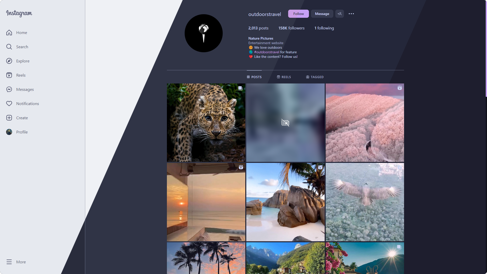
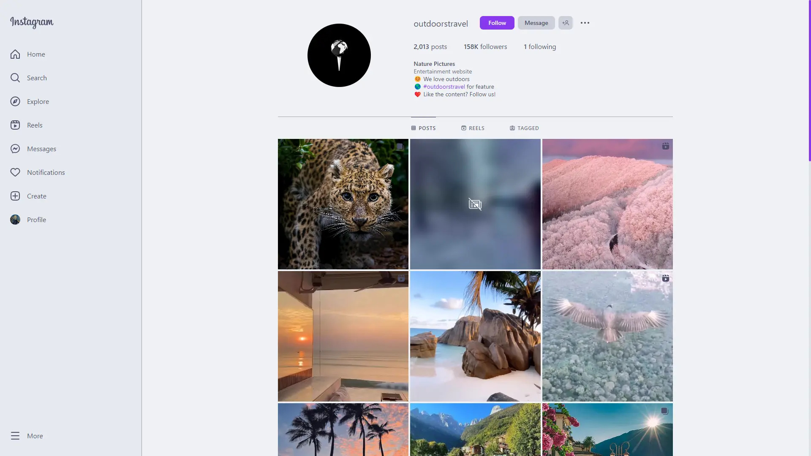
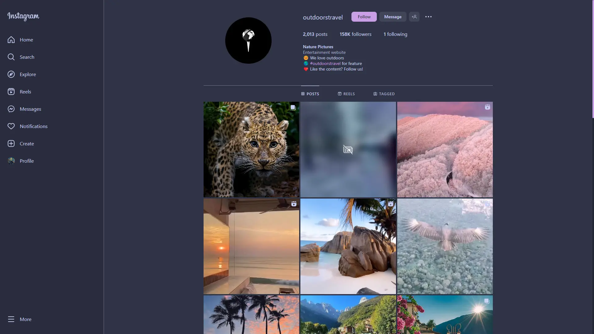
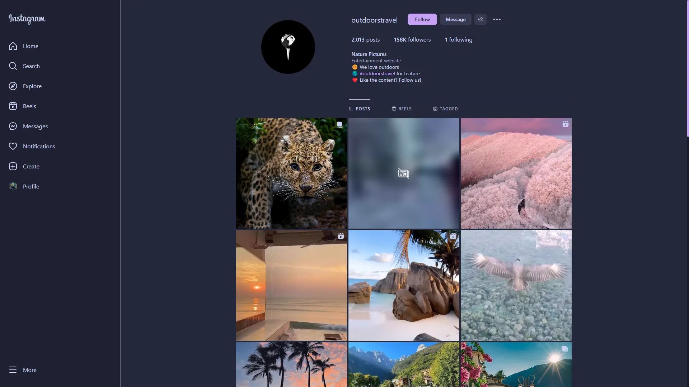
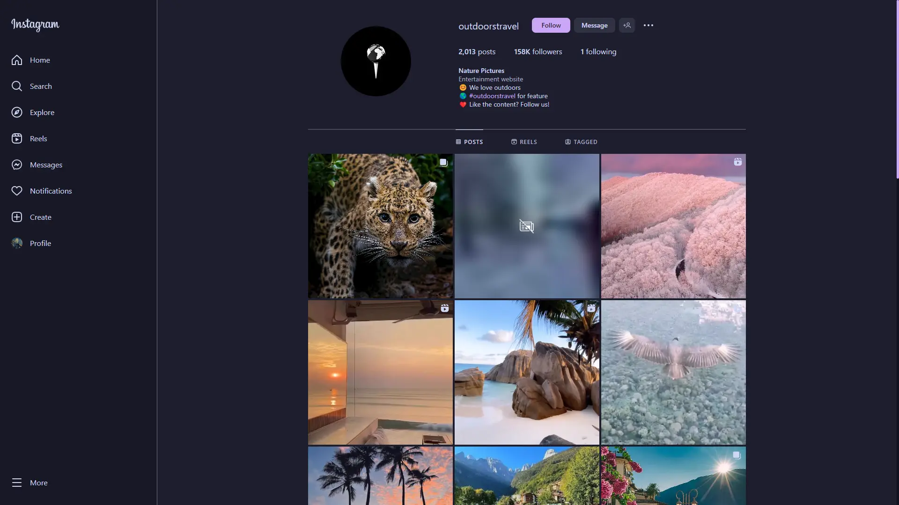
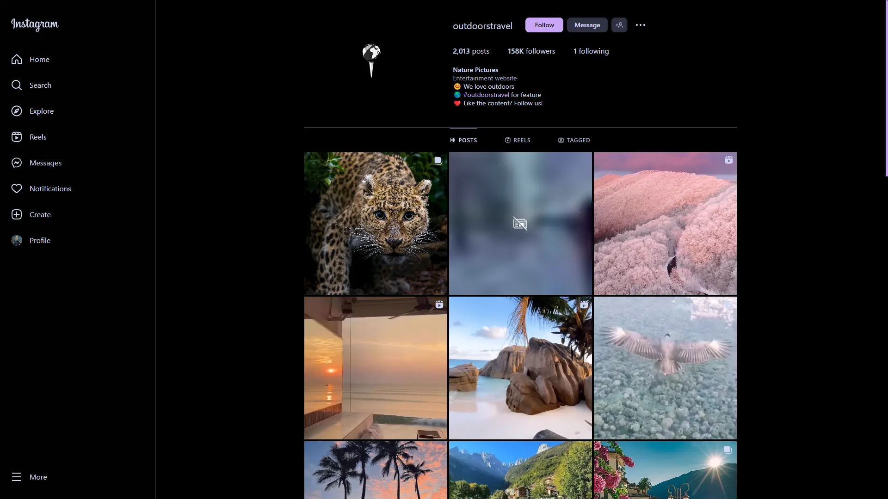

<h3 align="center">
     
    
    Catppuccin for <a href="https://instagram.com/">Instagram</a>
    
</h3>

    
    
    

    

## Previews

    
🌻 Latte

    

    
🪴 Frappé

    

    
🌺 Macchiato

    

    
🌿 Mocha

    

    
🫘 Espresso

    

## Usage

1.  Download the Stylus extension for [Chromium](https://chrome.google.com/webstore/detail/stylus/clngdbkpkpeebahjckkjfobafhncgmne)/[Firefox](https://addons.mozilla.org/en-US/firefox/addon/styl-us/).
2.  Enable "Patch CSP to allow style assets" in *Stylus Options > Advanced*.
3.  If you are using Firefox, go to `about:config` and set `layout.css.has-selector.enabled` to `true`.
4.  Change the Instagram theme in *More > Switch Appearance* according to the flavour you are going to use:
    1.  If you are going to use Latte, change to the light theme.
    2.  Otherwise, select dark theme.
5.  [Click here](https://github.com/haiksgithub/catppuccin-instagram/raw/main/src/catppuccin.user.css) to install the user style.
6.  Choose the flavour, accent colour and scrollbar width.

## 💝 Thanks to

*   [haik](https://github.com/haiksgithub/)

&nbsp;

    

    Copyright &copy; 2021-present <a href="https://github.com/catppuccin" target="_blank">Catppuccin Org</a>

    

